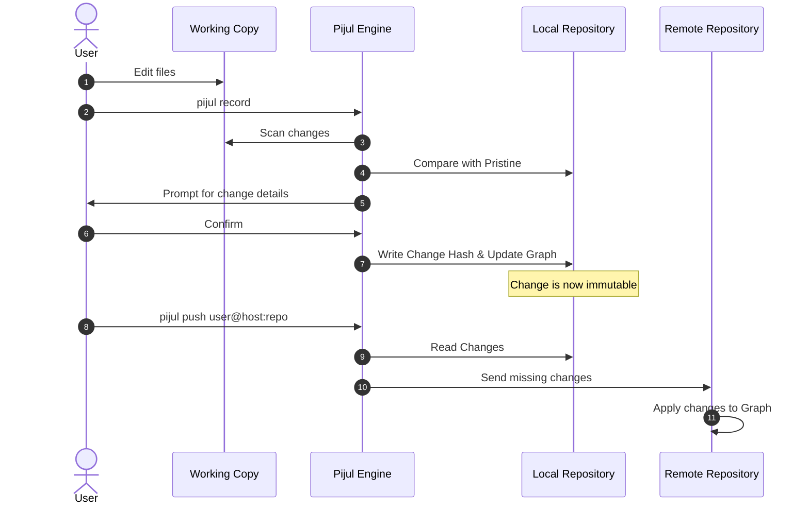

# Pijul

> A distributed version control system based on a sound mathematical theory of asynchronous work.

Pijul is a version control system that focuses on **changes** (patches) rather than snapshots. It solves many strict limitations of Git by modeling development history as a graph of changes that can be applied in any valid order. This commutativity makes merging easy and conflicts a solved problem.

## Why Pijul?

- **Conflict Resolution**: Conflicts are first-class citizens. Once you resolve a conflict, that resolution is recorded. If others encounter the same conflict, Pijul applies your resolution automatically. You never resolve the same conflict twice.
- **Commutativity**: Independent changes commute. You can cherry-pick any change from any branch without dragging along the entire history that led effectively to it.
- **Speed**: Pijul is written in Rust and optimized for performance, handling large repositories efficiently.
- **Channels**: Instead of branches, Pijul uses channels. Channels are simply different views into the same graph of changes.

## How Pijul Works

At its core, Pijul manages a **Directed Acyclic Graph (DAG)** of changes. When you modify your code:

1.  **Diff**: Pijul compares your working copy against the pristine internal state.
2.  **Record**: It generates a unique, immutable "Change" object representing your edits.
3.  **Apply**: This change is added to the graph.

Because changes are associative, the order in which you and your colleagues apply non-conflicting changes doesn't matter. The final state of the repository will be the same.

### The Flow of Change

Here is a visualization of how changes move through Pijul:



## Installation

### Via Cargo (Rust)

```bash
cargo install pijul --version "~1.0.0-beta"
```

## Quick Start

### Create a Repository

```bash
pijul init
```

### Tracking Files

Add files to be tracked:

```bash
pijul add <file>
```

### Recording Changes

Save your changes to the repository history:

```bash
pijul record
```

### Viewing History

See the log of changes:

```bash
pijul log
```

### Working with Remotes

Clone a repository:

```bash
pijul clone https://nest.pijul.com/pijul/pijul
```

Push your changes:

```bash
pijul push user@nest.pijul.com:repository
```

## Contributing

We welcome all contributions! Pijul is a community-driven project. We value mutual respect and inclusiveness.

Since this is a Rust project, please ensure your code is formatted before recording changes. You can set up a hook to do this automatically:

**`.pijul/config`**:

```toml
[hooks]
record = [ "cargo fmt" ]
```

## License

GPL-2.0
